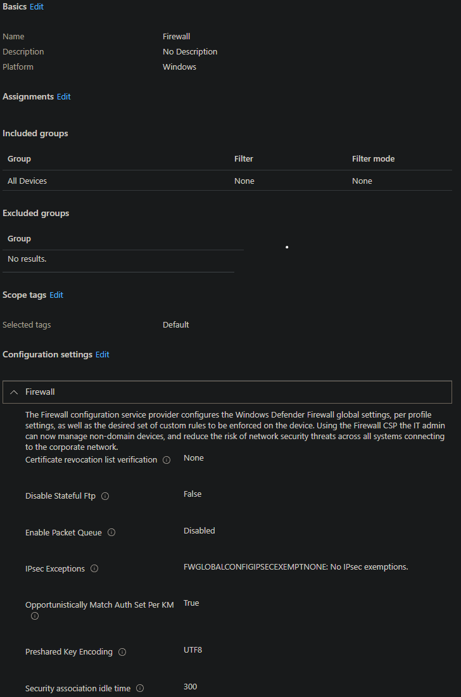

# Konfigurasjon av Windows brannmur
&nbsp;
## Kva og kvifor
Konfigurasjon av Windows-brannmur via Intune sikrar at alle einingar får like og oppdaterte reglar for nettverkssikkerheit. Dette reduserer risikoen for uautorisert tilgang, hindrar skadeleg trafikk, og sørgjer for at sikkerheit blir følgd konsekvent utan behov for manuell oppsett på kvar eining.

## Korleis
* Logg inn i intune: https://intune.microsoft.com
* Endpoint Security > Manage > Firewall
* 

## Resusrsar
https://learn.microsoft.com/en-us/intune/intune-service/protect/endpoint-security-firewall-policy