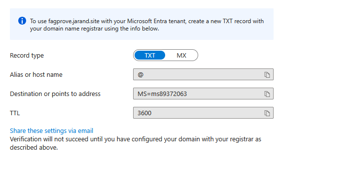
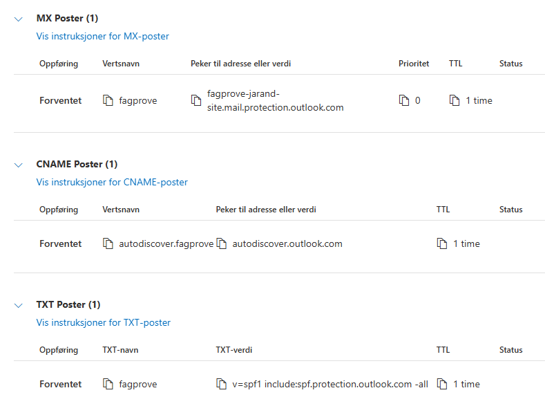
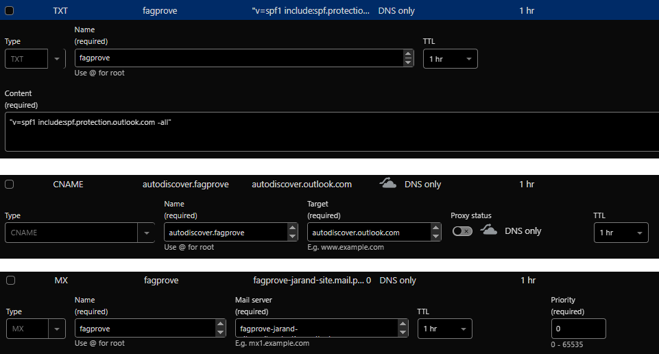

# Legge inn eige domene i entra
&nbsp;
## Kva og kvifor
Å legge til et eget domene i Entra gir deg muligheten til å bruke tilpassede e-postadresser og du gir et mer profesjonelt preg, både for e-postadresser og brukernavn.

## Korleis
* Logg inn på microsoft 365 administrasjonsenter: https://admin.microsoft.com/
* Innstillinger > Domener > Legg til domene 
* Fyll ut: **Domenenavn** > Bruk dette domenet > Bekreft
        
    * (i dette tilfele blirt fagprove.jarand.site brukt då det er det eg eiger)
* På sida "Bekreft at du eier domenet" velg Flere alternativer > Legg til en TXT-post i domenets DNS-poster > Fortsett
* 
* Oppret DNS oppføring hjå DNS leverandøren
* 
* Trykk Verify **(Merk! av og til kan det ta tid før nye DNS oppføringar blir skynkronisert globalt og verifiseringa kan feile)**
* Gjenta så prosessen med disse for å få epost funksjonalitet

* Deretter trykk fortset

* Etter dette kan brukara tildelast fagprove.jarand.site domenet (Altso bruker@fagprove.jarand.site)

## Resusrsar
https://learn.microsoft.com/en-us/entra/identity/users/domains-manage