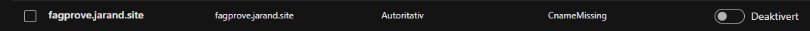
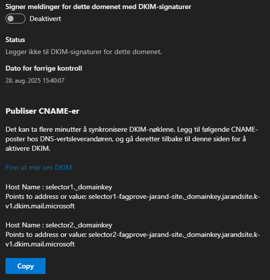

# Legge inn eige domene i entra
&nbsp;
## Kva og kvifor
Her blir domenet sikra med SPF, DKIM og DMARC
* SPF, DKIM og DMARC beskyttar domenet ditt mot misbruk som spam og phishing:
* SPF bestemmer kva serverar som kan sende e-post frå domenet ditt.
* DKIM legg til ein digital signatur som verifiserer at e-posten er ekte og ikkje endra.
* DMARC gir reglar for korleis e-post som feilar sjekkar skal handterast, og sender rapportar om misbruk.

Dette aukar tryggleiken og tilliten til e-postar frå domenet ditt.

## Korleis

### Aktivere DKIM 
Logg inn i microsoft defender og naviger deg til DKIM innstillinger:
https://defender.microsoft.com > Epost og sammarbeid > Policyer og regler > Trusselpolicyer > Innstillinger for e-postgodkjenning

Gå til DKIM menyen og trykk på veksleknappen. (Dette kan du og gjer på onmicrosoft domenet ditt)

Trykker du på domenet du kan få opp DKIM DNS oppføringane som skal leggast inn hjå DNS leverandør.

Totalt må ein opprette følgane DNS oppføringar:
| Teneste | Type | Navn | Endepunkt/Verdi | TTL |
|-----|---|---|---|---|
| SPF | TXT | fagprove.jarand.site | v=spf1 include:spf.protection.outlook.com -all | auto |
| DKIM | CNAME | selector1._domainkey | selector1-fagprove-jarand-site._domainkey.jarandsite.k-v1.dkim.mail.microsoft | auto |
| DKIM | CNAME | selector2._domainkey | selector2-fagprove-jarand-site._domainkey.jarandsite.k-v1.dkim.mail.microsoft | auto |

## Resusrsar
https://learn.microsoft.com/nb-no/defender-office-365/email-authentication-spf-configure#spf-txt-records-for-custom-domains-in-microsoft-365

https://learn.microsoft.com/en-us/defender-office-365/email-authentication-dkim-configure#syntax-for-dkim-cname-records