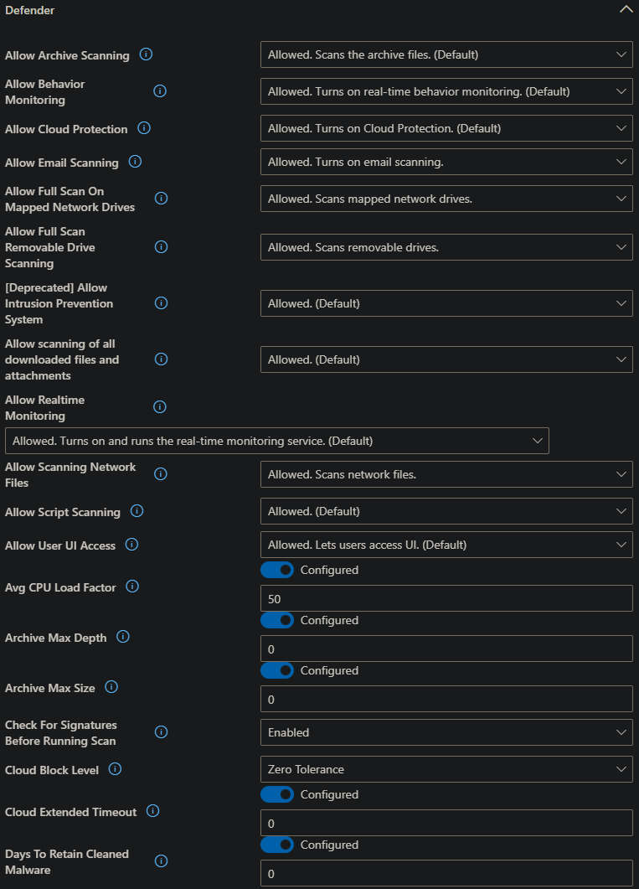
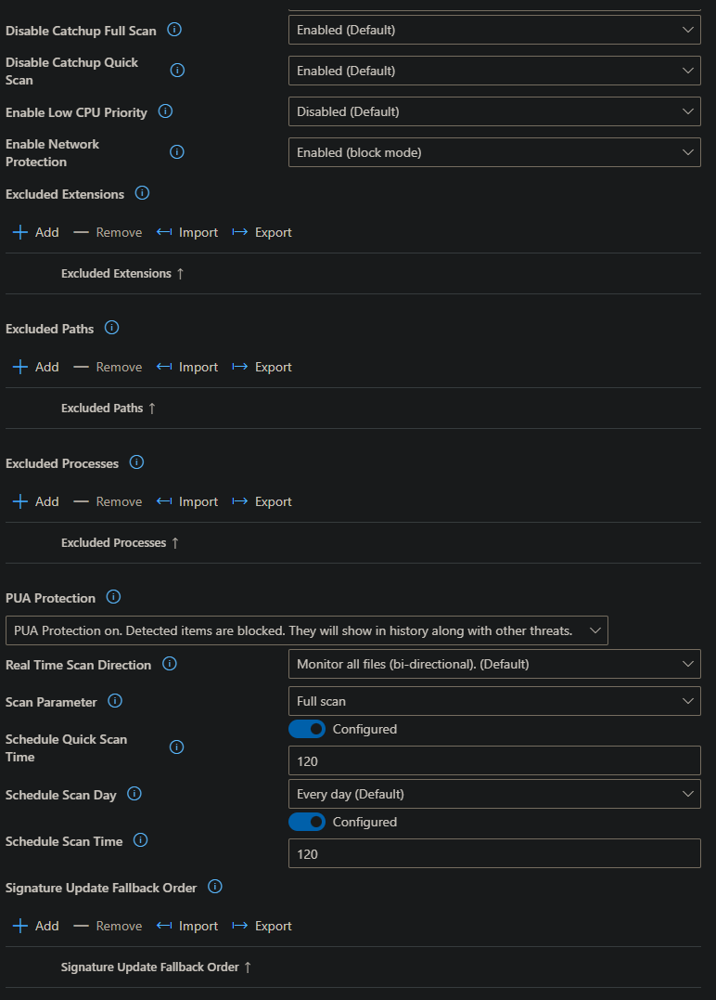

# Antivirus
&nbsp;
## Kva og kvifor
Antivirus vernar einingane mot skadeleg programvare, virus og truslar frå nettet. Ved å konfigurere Microsoft Defender Antivirus via Intune, sikrar ein at vern er aktivert og oppdatert på alle einingar i organisasjonen. Dette gir ei standardisert og sentralstyrt løysing for endepunktsvern.

## Korleis
* Logg inn i intune: https://intune.microsoft.com
* Endpoint Security > Manage > Antivirus > Create policy
* Name: Antivirus
* 
* 
* 
* Assignment
    * Included Groups: All Devices
## Resusrsar
https://learn.microsoft.com/en-us/defender-endpoint/use-intune-config-manager-microsoft-defender-antivirus